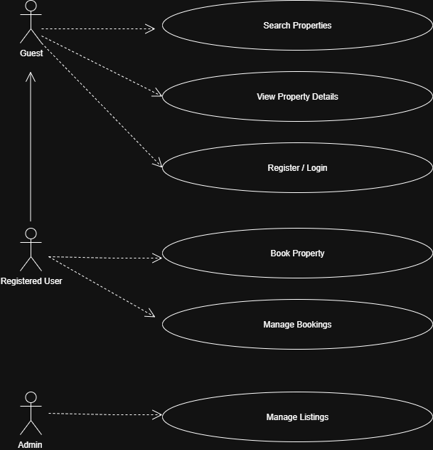

# Requirement Analysis in Software Development

This repository is dedicated to exploring the process of Requirement Analysis in software development. It provides detailed explanations, examples, and visual aids to help learners and practitioners understand how to define, document, and validate software requirements effectively. 

The content covers key topics such as the concept and importance of Requirement Analysis, key activities, types of requirements, use case diagrams, and acceptance criteria. Additionally, practical examples for a booking management system are included to illustrate these concepts in action.

## What is Requirement Analysis?

Requirement Analysis is a critical phase in the Software Development Life Cycle (SDLC) where the project team gathers, analyzes, and defines the requirements of the software to be developed. Its main goal is to ensure that all stakeholders—including users, clients, and developers—have a clear and shared understanding of what the system should do and how it should perform.

The importance of Requirement Analysis in SDLC includes:
- **Clarity and Understanding:** Reduces misunderstandings among stakeholders.  
- **Scope Definition:** Clearly defines project boundaries to prevent scope creep.  
- **Basis for Design and Development:** Provides a solid foundation for building the system.  
- **Cost and Time Estimation:** Helps accurately estimate resources, time, and costs.  
- **Quality Assurance:** Ensures the final product meets specified requirements and stakeholder expectations.

## Why is Requirement Analysis Important?

Requirement Analysis is essential in the Software Development Life Cycle (SDLC) because it ensures that software development is efficient, accurate, and aligned with stakeholder needs. Here are some key reasons why it is critical:

1. **Clarity and Understanding:** It helps all stakeholders, including users, clients, and developers, clearly understand what the software should do, reducing ambiguity and miscommunication.

2. **Scope Definition:** Requirement Analysis defines the project scope clearly, which prevents scope creep and ensures the team focuses on agreed-upon functionalities.

3. **Basis for Design and Development:** By providing detailed and structured requirements, it serves as a foundation for designing, developing, and testing the system effectively.

4. **Cost and Time Estimation:** Accurate requirements allow for better estimation of project resources, time, and cost, helping to avoid delays and budget overruns.

5. **Quality Assurance:** Clearly defined requirements ensure that the final product meets expectations and quality standards, increasing stakeholder satisfaction.

## Key Activities in Requirement Analysis

Requirement Analysis involves several key activities to ensure that the software meets stakeholder needs. These activities include:

- **Requirement Gathering**  
  Collecting initial information from stakeholders using techniques such as:
  - Interviews to understand stakeholder needs.
  - Surveys or questionnaires for larger audiences.
  - Workshops to discuss and gather requirements.
  - Observation of end-users in their working environment.
  - Document analysis to review existing systems and documentation.

- **Requirement Elicitation**  
  Refining and elaborating on gathered requirements using:
  - Brainstorming sessions to generate ideas.
  - Focus groups for detailed discussions with selected stakeholders.
  - Prototyping to help stakeholders visualize the system and refine requirements.

- **Requirement Documentation**  
  Recording requirements in a structured format:
  - Requirement Specification Document listing all functional and non-functional requirements.
  - User stories describing functionalities from the user’s perspective.
  - Use case diagrams to show interactions between users and the system.

- **Requirement Analysis and Modeling**  
  Examining and prioritizing requirements:
  - Requirement prioritization based on importance and impact.
  - Feasibility analysis considering technical, financial, and time constraints.
  - Modeling (e.g., data flow diagrams, entity-relationship diagrams) to visualize and analyze requirements.

- **Requirement Validation**  
  Ensuring requirements are complete and correct:
  - Reviewing and approving documented requirements with stakeholders.
  - Defining clear acceptance criteria for each requirement.
  - Establishing traceability matrices to ensure all requirements are addressed during development and testing.

## Types of Requirements

Requirement Analysis identifies two main types of requirements: **Functional** and **Non-functional**. Both are essential to ensure the system works correctly and meets stakeholder expectations.

### Functional Requirements 
Functional requirements describe **what the system should do**. They define the specific functionalities and features that the software must provide.  

**Examples for the booking management system:**
- **Search Properties:** Users can search for properties by location, price, and availability.  
- **User Registration:** New users can create accounts with personal details and login credentials.  
- **Property Listings:** Display properties with essential details and images.  
- **Booking System:** Users can book properties, view booking details, and manage their bookings.  
- **User Authentication:** Secure login and registration process for users.

### Non-functional Requirements 
Non-functional requirements describe **how the system should perform**. They focus on quality attributes rather than specific features.  

**Examples for the booking management system:**
- **Performance:** The system should load pages within 2 seconds and handle up to 1000 concurrent users.  
- **Security:** Ensure data encryption, secure login, and protection against vulnerabilities.  
- **Scalability:** The system should scale horizontally to handle increased traffic.  
- **Usability:** The application should have an intuitive UI/UX for easy navigation.  
- **Reliability:** The system should have 99.9% uptime and recover quickly from failures.

## Use Case Diagrams

### What are Use Case Diagrams?
Use Case Diagrams provide a visual representation of how different users (actors) interact with the system to achieve specific goals (use cases). They help stakeholders and developers understand system functionalities and interactions clearly.

### Benefits of Use Case Diagrams
- Visual representation of system functionalities
- Identify and organize system requirements
- Facilitate communication among stakeholders and the development team
### Booking System Use Case Diagram

## Acceptance Criteria

### What is Acceptance Criteria?
Acceptance criteria are specific conditions that a feature must meet to be accepted by stakeholders. They ensure that all parties have a clear understanding of what the system should deliver and provide a measurable basis for testing and validation.

### Importance of Acceptance Criteria
- Clarifies feature requirements for developers, testers, and stakeholders.
- Provides a benchmark to validate whether a feature meets expectations.
- Helps maintain quality and ensures the final product aligns with user needs.

### Example: Checkout Feature in Booking Management System
For the **Checkout feature**, acceptance criteria could be:

1. Users can review their booking details before confirming payment.
2. Users can select a preferred payment method (e.g., credit card, PayPal).
3. After payment, users receive a confirmation email within 2 minutes.
4. The system updates the booking status to “Confirmed” immediately after successful payment.
5. The payment process must be secure, ensuring all sensitive information is encrypted.

By defining these criteria, the development and QA teams know exactly what must be achieved for the feature to be considered complete.

